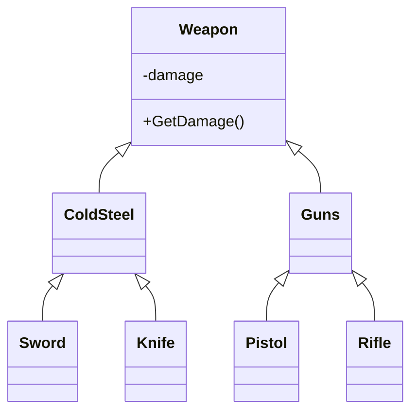

# Отношения между классами 


## Наследование

Наследование это одна из парадигм Объектно-ориентированного программирования. Наследование позволяет одному классу унаследовать поведение другого класса.

Класс от которого наследуются называют — родительским. Класс который наследуется от другого класса, называют — дочерним.

```c#
class Parent {
    public void SayHi() {
        Console.WriteLine("Parent:: Hi!");
    }
}

class Child : Parent { }

class Programs {
    static void Main(string[] args) {
        Child child = new Child();
        // Дочерний класс использует метод родительского
        child.SayHi(); 
        
        // Вывод на консоль: 
        // Parent:: Hi!
    }
}
```

Дочерний класс может использовать все поля и методы своего родителя помеченные как **открытые** (**public**) или **защищенные** (**protected**) .

Наследование является отношением типа — **is a**; то есть один класс является подклассом другого. Примеры: машина **является** транспортом, катер **является** транспортом, меч **является** холодным оружием, холодное оружие **является** подвидом оружия…

```c#
class Weapon {
    private double damage;
    public Weapon (double damage) {
        this.damage = damage;
    } 
    public double GetDamage() {
        return damage;
    }
}

class ColdSteel : Weapon {}
class Sword : ColdSteel {}
class Knife : ColdSteel {}

class Guns : Weapon {}
class Pistol : Guns {}
class Rifle : Guns {}
```



Наследование используется для создания **иерархии** похожих по поведению классов.

## Реализация


## Ассоциация 


## Агрегация

Когда использовать агрегацию?

Отношения между типами Sword являются наследованием, а вот ссылка внутри класса Slayer на тип Sword — это агрегация; когда один компонент содержит в себе ссылку на другой. При агрегации объект может быть создан вне класса и быть присвоенным через конструктор или метод, как в примере через метод ChangeSword. 

При композиции объект существует и создается только внутри класса, а также уничтожается вместе с классом контейнером:

```c#
class Slayer {
    private Sword sword;
    public Slayer () {
        sword = new DefaultSword ();
    }
}
```

В данном примере объект создается в конструкторе во время создания нового экземпляра класса Slayer, и изменить его нельзя. Объект будет уничтожен вместе с классом Slayer.


## Композиция


