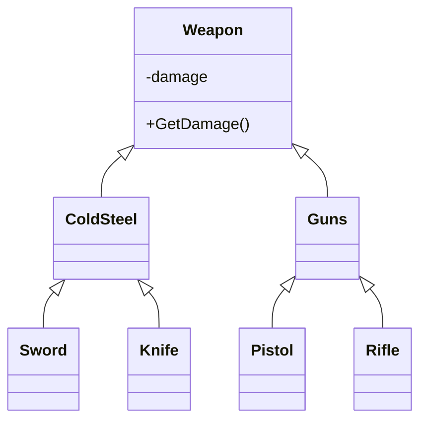
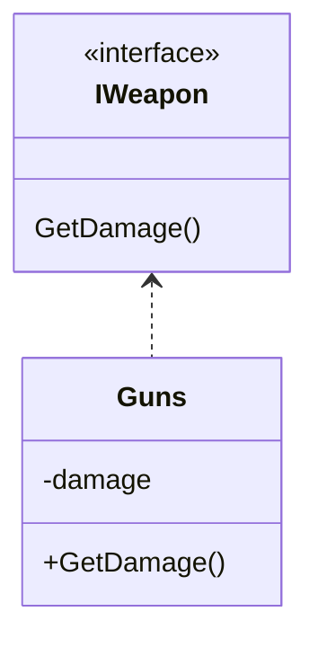
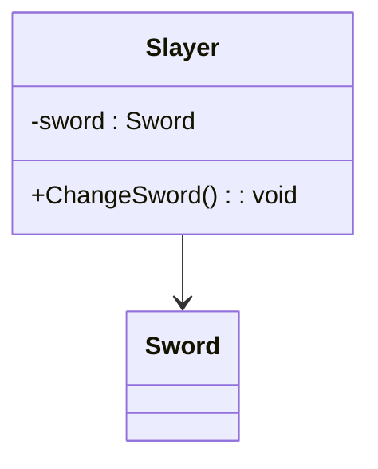
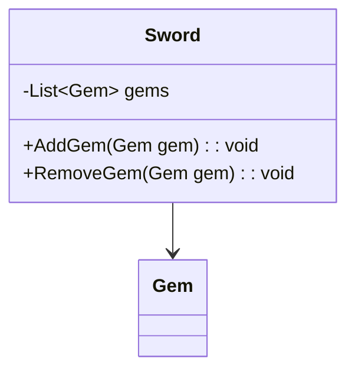
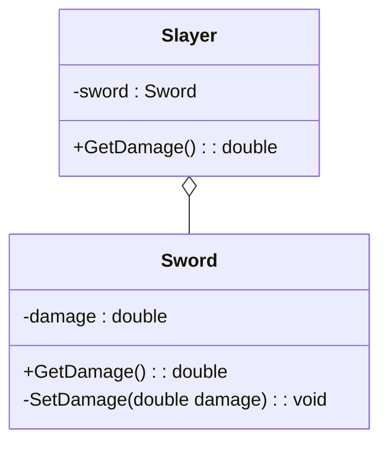
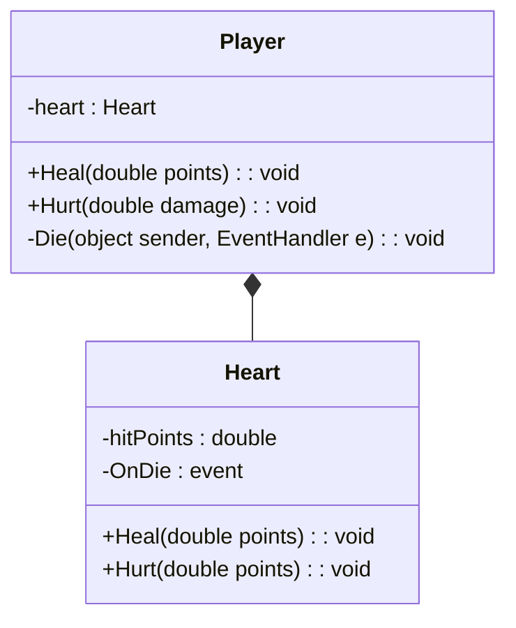

# Отношения между классами 

1. [Наседование](#Наследование)
2. [Реализация](#Реализация)
3. [Ассоциация ](#Ассоциация)
4. [Агрегация](#Агрегация)
5. [Композиция](#Композиция)

## Наследование

Наследование это одна из парадигм Объектно-ориентированного программирования. Наследование позволяет одному классу унаследовать поведение другого класса.

Класс от которого наследуются называют — родительским. Класс который наследуется от другого класса, называют — дочерним.

```c#
class Parent {
    public void SayHi() {
        Console.WriteLine("Parent:: Hi!");
    }
}

class Child : Parent { }

class Programs {
    static void Main(string[] args) {
        Child child = new Child();
        // Дочерний класс использует метод родительского
        child.SayHi(); 
        
        // Вывод на консоль: 
        // Parent:: Hi!
    }
}
```

Дочерний класс может использовать все поля и методы своего родителя помеченные как **открытые** (**public**) или **защищенные** (**protected**) .

Наследование является отношением типа — **is a**; то есть один класс является подклассом другого. Примеры: машина **является** транспортом, катер **является** транспортом, меч **является** холодным оружием, холодное оружие **является** подвидом оружия…

```c#
class Weapon {
    private double damage;
    public Weapon (double damage) {
        this.damage = damage;
    } 
    public double GetDamage() {
        return damage;
    }
}

class ColdSteel : Weapon {}
class Sword : ColdSteel {}
class Knife : ColdSteel {}

class Guns : Weapon {}
class Pistol : Guns {}
class Rifle : Guns {}
```



Наследование используется для создания **иерархии** похожих по поведению классов.

## Реализация

Реализация подразумевает наследование от интерфейса и реализация всех его методов. 

Интерфейс — это контракт с классом, который обязует класс реализовать все методы интерфейса.

```c#
interface IWeapon {
    public double GetDamage ();
}

class Guns : IWeapon {
    private double damage;
    
    public Guns (double damage) {
        this.damage = damage;
    }
    
    // Реализация интерфейса
    public double GetDamage () {
        Console.WriteLine("Guns:: " + damage);
    }
}
```



Интерфейс необходимо использовать, когда нужно создать контракт с разными классами на реализацию определенных методов или свойств.

## Ассоциация 

Ассоциация это отношение в котором объекты ссылаются друг на друга, но остаются независимыми. То есть в одном объекте есть ссылка на другой, которую можно передать через метод или напрямую.

Отношение может быть **один к одному (1..1)**  (или **бинарным**):

```c#
class Sword {} 
class Slayer {
    private Sword sword;
    
    public void ChangeSword (Sword sword) {
        this.sword = sword;
    }
}
```

К примеру, персонаж игрока в компьютерной игре может существовать отдельно от его оружия, как и наоборот, — персонаж может просто выкинуть свой меч или отдать его другому игроку. То есть объекты могут существовать отдельно друг от друга. Однако в данном примере персонаж может держать только один меч. 



Отношение может быть **один ко многим (1..М)**  (или **N-нарным**):

```c#
class Gem {}
class Sword {
    private List<Gem> gems;
    
    public void AddGem (Gem gem) {
        gems.Add (gem);
    }
    
    public void RemoveGem (Gem gem) {
        gems.Remove (gem);
    }
} 
```

К примеру, в меч можно вставлять магические камни, которые будут давать дополнительные эффекты для оружия. Внутри класса содержится структура данных, которая хранит множество магических камней. Магические камни могут существовать отдельно от меча.



## Агрегация

При реализации объект находится внутри другого объекта, но они не зависят друг от друга и могут существовать порознь, в отличии от композиции, где внутренний объект полностью зависит от главного.

При агрегации объект создается извне и передается через конструктор.

Агрегация пример **слабой связи**, так как жизненный цикл вложенного объекта не зависит от жизненного цикла объекта контейнера. Если главный объект будет уничтожен, вложенный объект может продолжить существовать в памяти, если в этом есть необходимость, или быть уничтоженным.

Агрегация является отношением типа — **has a**.

```c#
class Sword {}
class Slayer {
    private Sword sword;
    public Slayer (Sword sword) {
        this.sword = sword;
    }
}
```

Чуть более интересный пример:

```c#
class Sword {
	private double damage;
    
	public Sword (double damage) {
		this.damage = damage;
	}
    
	public double GetDamage () {
		return damage;
	}
    
	protected void SetDamage (double damage) {
		this.damage = damage;
	}
}

class Slayer {
	private Sword sword;
    
	public Slayer (Sword sword) {
		this.sword = sword;
	}
    
	public double GetDamage () {
		Console.WriteLine ("Slayer damage: " + sword.GetDamage ());
		return sword.GetDamage ();
	}
}

class Program {
	static void Main (string[] args) {
		Sword sword = new Sword (100);
		Slayer slayer = new Slayer (sword);
		slayer.GetDamage ();
        
        // Вывод на консоль:
        // Slayer damage: 100
	}
}
```



Как правило при агрегации определяется ссылка не на конкретный класс, а на интерфейс или абстрактный класс.

```c#
abstract class Sword {}
class OrcSword : Sword {}
class Slayer {
    private Sword sword;
    public Slayer (Sword sword) {
        this.sword = sword;
    }
}

Sword sword = new OrcSword ();
Slayer slayer = new Slayer (sword);
```

Примером агрегации может служить паттерн “Декоратор” или “Адаптер”.

## Композиция

При композиции один объект находится внутри другого и полностью зависит от его жизненного цикла, в отличии от агрегации, где объекты могут существовать порознь.

При композиции внутренние объекты создаются в конструкторе класса при его инициализации. Если главный объект, который содержит в себе другие будет уничтожен, будут уничтожены все внутренние объекты. 

Композиция пример **сильной связи**, так как жизнь внутреннего объекта напрямую зависит от главного, который его содержит.

Композиция является отношением типа — **has a**.

```c#
class Heart {}
class Player {
    private Heart heart;
    public Player () {
        heart = new Heart ();
    }
}
```

Чуть более интересный пример:

```c#
class Heart {
	private double hitPoints;
	public event EventHandler OnDie;
    
	public Heart (double hitPoints) {
		this.hitPoints = hitPoints;
	}
    
	public void Heal (double points) {
		hitPoints += points;
	}
    
	public void Hurt (double points) {
		hitPoints -= points;
		if (hitPoints <= 0) {
			hitPoints = 0;
			Console.WriteLine("Heart Died!");
			OnDie?.Invoke (this, EventArgs.Empty);
		}
	}
}

class Player {
	private Heart heart;
    
	public Player (double hitPoints) {
		heart = new Heart (hitPoints);
		heart.OnDie += Die;
	}
    
	public void Heal (double healPoints) {
		heart.Heal (healPoints);
	}
    
	public void Hurt (double damage) {
		heart.Hurt (damage);
	}
    
	protected void Die (object sender, EventArgs e) {
		Console.WriteLine("Player Died!");
		// Do something...
	}
}

class Program {
	static void Main (string[] args) {
		Player player = new Player(100);
		player.Hurt(50);
		player.Hurt(25);
		player.Hurt(25);
        
        // Вывод на консоль:
		// Heart Died!
		// Player Died!
	}
}
```

